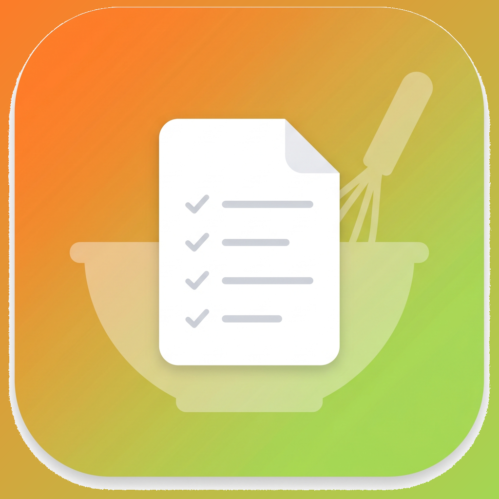

<div align="center">
  
  <h1>Watchdoo</h1>
  <p><strong>Your Cookidoo shopping list on the Apple Watch.</strong></p>
</div>

A standalone watchOS app that accesses the shopping list from the Cookidoo app (Thermomix/Vorwerk) through a self-hosted backend. UI languages: 🇩🇪 German, 🇬🇧 English.

## ⚠️ Disclaimer

This project uses an **unofficial API** (via [cookidoo-api](https://github.com/miaucl/cookidoo-api)). It is not affiliated with Vorwerk or Cookidoo. Use at your own risk — it may violate Cookidoo's Terms of Service.

*Cookidoo® and Thermomix® are registered trademarks of Vorwerk International AG. This project is not affiliated with, endorsed by, or sponsored by Vorwerk.*

## Architecture

```
Apple Watch (SwiftUI) ←→ Your Backend (FastAPI) ←→ Cookidoo Server
                          (Azure Container Apps)
```

- **Self-hosted**: each user runs their own backend
- **Cookidoo credentials** never leave your own server
- **Watch ↔ Backend**: secured via API key

## Features

- 🛒 View the shopping list (grouped by category or by recipe)
- ✅ Check items off as bought
- ➕ Add your own custom items
- 🗑️ Delete custom items and recipe ingredients
- ⌚ Standalone — no iPhone required at runtime
- 📱 iPhone companion app for one-time setup (server URL + API key sent via WatchConnectivity)

## Requirements

- Cookidoo account (with active subscription)
- Azure account (for Container Apps) or Docker for local hosting
- Xcode 15+ (for the Watch app)
- Apple Watch with watchOS 10+

## 🚀 Quick Start

### 1. Run the backend locally

```bash
cd backend
cp .env.example .env
# Edit .env: enter your email, password, and an API key

pip install -r requirements.txt
uvicorn app.main:app --reload
```

Test it:
```bash
curl http://localhost:8000/api/v1/health
curl -H "X-API-Key: your-key" http://localhost:8000/api/v1/shopping-list
```

### 2. Deploy the backend to Azure

```bash
# Set environment variables
export COOKIDOO_EMAIL="you@email.com"
export COOKIDOO_PASSWORD="your-password"
export API_KEY=$(openssl rand -hex 32)

cd backend/deploy
./deploy.sh
```

The script prints the backend URL on completion.

### 3. Install the Watch app

1. Open `Watchdoo/Watchdoo/Watchdoo.xcodeproj` in Xcode
2. **Change the bundle identifiers** (in `Signing & Capabilities` for each target):
   - Replace `com.example.Watchdoo*` with your own reverse-DNS ID (e.g. `dev.yourname.Watchdoo*`)
   - Select your Apple Developer Team
3. Build & run the companion app on iPhone (scheme: `Watchdoo`)
4. Build & run the Watch app (scheme: `Watchdoo Watch App`)
5. On the iPhone: enter the server URL and API key → "Send to Watch"

> The `WKCompanionAppBundleIdentifier` link between the Watch and iPhone targets must stay consistent — otherwise the Watch will not find its iPhone counterpart.

## API Endpoints

| Method   | Endpoint                                            | Description                       |
|----------|-----------------------------------------------------|-----------------------------------|
| `GET`    | `/api/v1/health`                                    | Health check (no auth)            |
| `GET`    | `/api/v1/shopping-list`                             | Full shopping list                |
| `PATCH`  | `/api/v1/shopping-list/ingredients`                 | Toggle ingredients as bought      |
| `PATCH`  | `/api/v1/shopping-list/additional-items/ownership`  | Toggle custom items as bought     |
| `POST`   | `/api/v1/shopping-list/additional-items`            | Add custom items                  |
| `PUT`    | `/api/v1/shopping-list/additional-items`            | Edit custom items                 |
| `DELETE` | `/api/v1/shopping-list/additional-items/{id}`       | Delete a custom item              |
| `DELETE` | `/api/v1/shopping-list/recipes/{recipe_id}`         | Remove a recipe's ingredients     |
| `POST`   | `/api/v1/auth/refresh`                              | Refresh the Cookidoo token        |

All endpoints (except `/health`) require the `X-API-Key` header.

## Project Layout

```
watchdoo/
├── backend/
│   ├── app/
│   │   ├── main.py              # FastAPI app
│   │   ├── config.py            # Settings
│   │   ├── models.py            # Pydantic models
│   │   ├── middleware.py        # API-key auth
│   │   ├── routers/
│   │   │   ├── shopping_list.py # Shopping-list endpoints
│   │   │   └── auth.py          # Auth endpoints
│   │   └── services/
│   │       └── cookidoo.py      # Cookidoo API wrapper
│   ├── Dockerfile
│   ├── requirements.txt
│   └── deploy/
│       └── deploy.sh            # Azure 1-click deploy
└── Watchdoo/              # Xcode workspace
    └── Watchdoo/
        ├── Watchdoo Watch App/   # watchOS target
        │   ├── WatchdooApp.swift
        │   ├── Models/
        │   ├── Views/
        │   ├── Services/
        │   └── Connectivity/
        └── Watchdoo/             # iOS companion target
            ├── WatchdooCompanionApp.swift
            ├── Views/
            └── Services/
```

## Costs

- **Azure Container Apps**: ~€3–5 per month (scales to zero when idle)
- **Cookidoo subscription**: existing subscription required

## License

MIT — see [LICENSE](LICENSE).

## Contributing

See [CONTRIBUTING.md](CONTRIBUTING.md). Please report security issues per [SECURITY.md](SECURITY.md).

---

> Cookidoo® and Thermomix® are registered trademarks of Vorwerk International AG.
> This project is an independent, community-built tool and is **not affiliated with, endorsed by, or sponsored by Vorwerk**. All trademarks remain the property of their respective owners.
